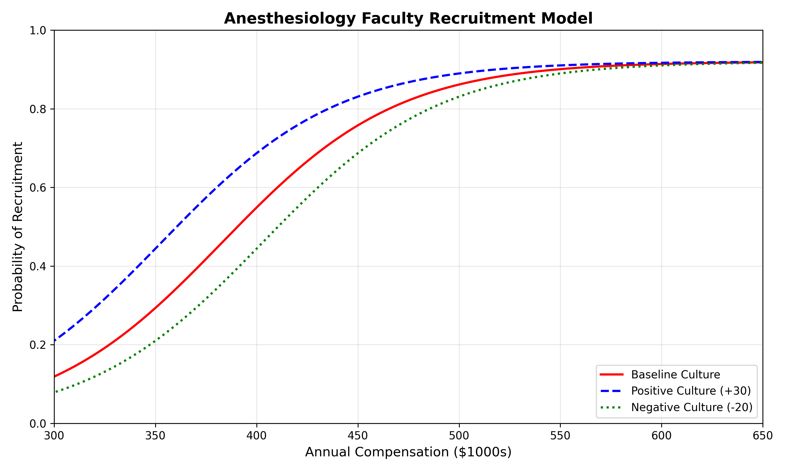

# A Quantitative Model for Optimizing Academic Anesthesiology Recruitment

**To the Editor,**

We write to propose a practical, quantitative tool for academic anesthesiology chairs navigating today's competitive recruitment market. The recruitment and retention of anesthesiology faculty in academic medical centers has become increasingly challenging amid a highly competitive labor market[^1_2][^1_5]. We propose a novel, quantitative model for optimizing recruitment offers by conceptualizing the relationship between compensation and recruitment success as a sigmoidal dose-response curve, drawing upon pharmacological principles.

The labor market for anesthesiologists is characterized by significant workforce shortages and high demand, with up to 78% of facilities reporting staffing shortages in late 2022[^1_5]. This has driven salaries upward, with national averages ranging from approximately $393,000 to $540,000[^2_1][^2_3][^2_4]. Academic departments often find themselves at a disadvantage, with a median compensation gap of around $40,000 compared to private practice[^2_3].

Our model addresses this challenge by applying a sigmoidal function to recruitment:

$$
P(\text{Recruitment}) = \frac{a}{1 + \exp(-b(x - (c - k)))}
$$

where *x* is compensation, *a* is the maximum recruitment probability, *b* is the slope, *c* is the inflection point (compensation at 50% probability), and *k* is a quantifiable "culture factor." This culture factor represents the monetary value of non-compensatory benefits such as work-life balance, academic environment, and departmental reputation. A positive culture shifts the curve to the left, allowing for successful recruitment at a lower compensation, while a negative culture shifts it to the right, requiring higher pay to attract candidates (Figure 1).

**Figure 1: The Dose-Response Recruitment Curve.** The model illustrates the relationship between compensation and recruitment probability. The baseline (red) shows the probability based on compensation alone. A positive departmental culture (blue) shifts the curve left, achieving higher recruitment probability at lower compensation. A negative culture (green) shifts it right, requiring higher compensation for the same probability.

This model allows leadership to make data-informed decisions, balancing the immediate need to fill positions with long-term financial sustainability and the strategic value of investing in departmental culture. By quantifying the impact of departmental culture, it highlights the importance of investing in intrinsic motivation and job satisfaction as a strategic tool for recruitment and retention[^8_1][^8_5]. Further study is needed to validate this model with real-world data, but it offers a promising approach for navigating the complexities of academic anesthesiology recruitment.

## References

[^1_2]: https://earnbetter.com/jobs/click/01JS8E0R1M0D2GDWBZ8165E3SM/?utm_source=perplexity
[^1_5]: https://www.asahq.org/about-asa/newsroom/news-releases/2024/06/anesthesia-workforce-shortage-poses-threat-to-health-care
[^2_1]: https://earnbetter.com/jobs/click/01JV7QQK04M7FCT3FAR3KZS35A/?utm_source=perplexity
[^2_3]: https://www.amnhealthcare.com/blog/physician/perm/anesthesiologist-salary-outlook-for-2025-trends-and-insights/
[^2_4]: https://money.usnews.com/careers/best-jobs/anesthesiologist/salary
[^8_1]: https://jnae.scholasticahq.com/article/140529
[^8_5]: https://dpianes.com/the-crucial-role-of-anesthesia-management-in-recruiting-and-retaining-top-tier-anesthesiologists-and-certified-registered-nurse-anesthetists/